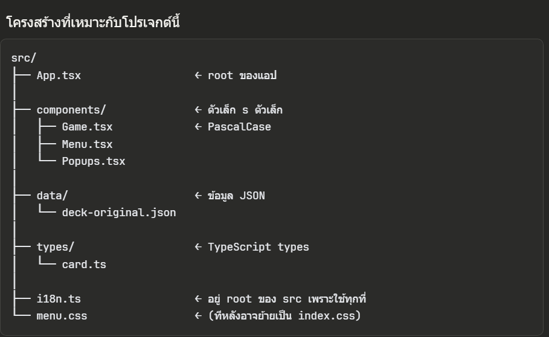

ใช้สร้างโปรเจคใหม่
    - npm create vite@latest roi-kaew -- --template react-ts

CD เข้าโปรเจค์
    - cd roi-kaew

เปิด server
    - npm run dev

# Concept ของ react + vite + js
0. 100% of loop
1. แต่ละเครื่องมือ คืออะไร จุดประสงค์(ทำไมต้องใช้อันนี้ไม่ใช้อันนั้นล่ะ) จุดแข็ง และธรรมชาติของการเลือกก่อน 
    1.1 สิ่งที่เราจะทำคืออะไร และ ธรรมชาติของสิ่งที่เราจะทำ ปกติแล้วเราต้องใช้อะไรบ้าง ต้องมีอะไรบ้างถึงจะพอ -> "เพื่อเป็นโคตรงสร้างในใจเรา" และยกตัวอย่างด้วย การทำงานที่ lean ที่สุดก่อนก็ได้ เพื่อให้เข้าใจ cycle ครบ (อธิบาย ใช้เพื่อ... เข้าไปเยอะ ๆ )
    EX. (รถยนต์เนี่ย เป็น อะไรที่เราใช้นั่งหรือโดยสร้างเพื่อพอเราเคลื่อนที่จากจุดหนึ่งไปจุดหนึ่ง โดยโครงสร้างของรถจะมี เครื่องยนต์ที่เป็นแรงขับ ล้อที่ใช้ต่อกับเครื่องยนต์ ระบบคุมควบต่างๆ เช่น พวงมาลัย คันเร่ง เบรก เพื่อให้รถเคลื่อนที่ตามที่เราต้องการ โครงรถรองรับการทำงาน)

    1.2 องค์ประกอบทั้งหมด เครื่องมือทั้งหมด ที่เราจะใช้ในงานนี้ และบทบาทของแต่ละเครื่องมือ ให้แนบด้วยว่า อะไรที่จำเป็นหรือไม่จำเป็น(บางอย่างไม่จำเป็น แต่ช่วยอำนวยความสะดวกได้) จะได้รู้จักแต่ละส่วนของการเรียน แค่หัวข้อก่อนก็พอ "เพื่อจะได้วางลำดับของแต่ละเครื่องมือในใจได้ถูก"
    EX. (เครื่องยนต์มีเพลา เฟื่อง ลูกสูบ ประเก็น ทุกส่วนจำเป็น แต่ว่าพวกการควบคุมเนี่ย ใช้แค่พวกมาลัย เกียร์ เบรคก็พอ เซ็นเซอร์ เข็มไมล์ ยังไม่ได้จำเป็นแต่เป็นตัวอำนวย)

    "การที่เราจะเข้าใจอะไรสักอย่าง มันเริ่มต้นจาก Base หรือ ฐาน (สิ่งจำเป็น) ก่อน แล้วค่อยเสริม+เพิ่ม+โบก (ไม่จำเป็นแต่ช่วยอำนวยความสะดวกได้) ความรู้เข้าไปทีละชั้น"

2. ลงรายละเอียดแต่ละเครื่องมือเลย โดยหัวข้อที่ต้องดูแต่ละเครื่องมือ คือ
    2.0 organize ก่อน แต่ละไฟล์/หัวข้อย่อย เป็นของหัวข้อใหญ่ไหนบ้าง (มีข้อบ่งชี้หรือสัญลักษณ์ว่าอะไรบ้าง) และมีอะไรที่เราสามารถแก้ไขหรือปรับแต่งได้(แก้ไขแล้วจะส่งผลอย่างไร ต่อ output) และมีที่มาจากไหน "เพื่อให้เรารู้ขอบเขตและความสามารถของเรา เหมือนดินน้ำมัน และเป็นจุดแรกที่เราจะเริ่มโฟกัส"
    2.1 ลำดับเรื่องที่จะเรียน โดยที่ 
    เราจะเรียนเรื่องอะไรกัน -> เรื่องนี้มาจากเครื่องมือไหน (ยึดโยงมาจากข้อ1) -> ต้องรู้คอนเซ็ปอะไรบ้าง เพื่อที่จะเรียนเรื่องนี้ (ถ้ามีผู้มีประสบการณ์ชี้แนะจะดีมาก) (ไม่จำเป็นต้องเล่าหมดทีเดียวก็ได้ สลับตัดไปมาได้)
        2.1.1 เช็คความเข้าใจด้วยการให้ นับจำนวน หรือ re-check ด้วยการถาม-กลับ
        2.1.4 Vocabulary -> ใช้เวลาในการเรียนรู้ รากฐานที่มั่นคง คำไหนไม่เข้าใจ ต้องหาเพิ่ม
        2.1.5 ความสัมพันธ์และความสำคัญ -> เครื่องมือนี้มี input&output ต่อภาพรวมยังไง
        2.1.2 การทำงานแบบ None-techique เล่าง่ายๆ ใช้การเปรียบเทียบช่วยก็ได้ เพื่อเข้าใจเบื้องหลังการทำงาน
        2.1.3 การทำงานแบบ techique เพื่อความเข้าใจอย่างแท้จริง

        2.1.6 จดบันทึกด้วยล่ะ
        


Structure (โครงสร้าง) -> React + vite
Presentation (ตกแต่ง) -> TailwindCSS
Logic (ระบบการทำงาน)
State (ความจำ)
Routing (เปลี่ยนหน้า)
Assets
Build System
Deployment
Testing
Security
ไม่จำเป็นแต่ดี -> TypeScript, Github

| ไฟล์/โฟลเดอร์      | แก้ได้ไหม | ความสำคัญ | หมายเหตุ               |
| ------------------ | --------- | --------- | ---------------------- |
| **src/**           | ✔️        | ⭐⭐ มาก    | ตัวเกมทั้งหมดอยู่ในนี้ |
| **App.tsx**        | ✔️        | ⭐⭐⭐       | แก้ UI หลัก            |
| **main.tsx**       | ✔️        | ⭐⭐        | รากของ React           |
| **index.html**     | ✔️        | ⭐         | เปลี่ยนชื่อเว็บ, icon  |
| **index.css**      | ✔️        | ⭐⭐        | global style           |
| **vite.config.ts** | ✔️        | ⭐⭐        | ระวังเวลาปรับ plugin   |
| **package.json**   | ✔️        | ⭐⭐        | สำหรับเพิ่ม library    |
| **public/**        | ✔️        | ⭐         | ภาพ/เสียง              |
| **node_modules/**  | ❌         | –         | ห้ามแตะเด็ดขาด         |


React component
https://codinggun.com/react/component/


# React
ทำงานเป็น componant เป็น set function
แต่ละ .tsx จะเก็บ function ต่างๆเอาไว้ แต่จะ output อันไหน ก็ต้อง export default [name] ด้วย
ใน main.tsx -> createRoot คือ output ของหน้าเว็บ

Ex. of JAX element -> <button className="square">X</button>
A JSX element is a combination of JavaScript code and HTML tags that describes what you’d like to display
React components need to return a single JSX element Then we gonna use Fragments (<> and </>) to wrap multiple adjacent JSX elements to a sigle JSX

## className
className คือการตั้งชื่อ element นั้นๆ จะมีการตั้ง classname เต็มไปหมดเพื่อให้สามารถรับ css ได้ในคราวเดียว
escape character for value is {value}

## tag
tag ทำงานเป็น พิมพ์ดีด(กล่องแนวนอน), ขึ้นtag=พิมพ์แนวนอนไปเรื่อย ๆ
เมื่อเอา tag ซ้อน tag จะกล่องเป็นกล่องซ้อนกล่อง
div คืออะไร
``` tsx
<div className="flex gap-4"> ใส่ไว้ที่ฐาน flex = แนวนอน, gap-4 = ระยะห่างระหว่าง
``` 
ควรวาง กล่องที่ใหญ่ที่สุดเป็นฐานก่อน คือ header main_area footer


## const state setstate
const [state, setState] = useState(initialState)
const -> ใช้สร้างตัวแปร const (ตัวแปรที่ไม่ได้ re-render)
state -> ตัวแปรตัวหนึ่ง ไม่สามารถถูกเปลี่ยนแปลงได้ นอกจากต้องเขียนทับด้วย setState เท่านั้น
setState -> ใช้อัพเดทค่า stateนั้นๆ โดยเฉพาะ เพราะมีเรื่องการUpateค่าใหม่ๆเสมอ เลยต้องมี function การupdateโดยเฉพาะ (ตัวแปรที่จะเกิด re-render เมื่อเปลี่ยนแปลง)
useState(initialState) -> ค่าตั้งต้นแรกสุดให้ state
const ต้องอยู่ใน function ด้วยนะ

## root component
    component ตั้งต้น มาจาก main.tsx
createRoot(document.getElementById('root')!).render()

## re-render
    ใช้updateหน้าเว็บเฉพาะส่วน มี 3 กรณีที่จะ re-render
    1. setState() -> อัพเดทตัวแปร, ใช้สำหรับการ output ด้วย
    2. Props() -> เมือมีการ ส่งค่าใหม่ เข้าไปในfunction
    3. Component แม่ re-render → ลูกต้อง re-render ไปด้วย

## loop tag
ต้องการสร้าง tag มากกว่าหนึ่งอัน หรือ สร้างtag ที่สัมพันธ์กับ array
``` tsx
<div className="player_setup">
                        player setup
                        <div>{player_list.map(player_list => (
                            <div className='player_box' key={player_list}> Player {player_list} : <input name="myInput" /> </div>
                        ))}</div>
                    </div>
```


# CSS Part
## Box Model
ทุก element มีโครงสร้างแบบนี้:
┌──────── margin ────────┐
│ ┌───── border ─────┐  │
│ │ ┌── padding ──┐ │  │
│ │ │   content   │ │  │
│ │ └─────────────┘ │  │
│ └─────────────────┘  │
└───────────────────────┘

- margin = ระยะห่างจาก tag อื่นๆ
- border = เส้นขอบ
- padding = ระยะจาก content → border
- content = ข้อความ/ปุ่ม/รูป สามารถกำหนด width / height เพื่อเป็นขนาด content

- border + padding = ตัวรูปลักษณ์ของกล่อง
- padding กับ conttent เป็นก้อนเดียวกัน สำหรับข้อความ


## คำศัพท์ และ คุณลักษณะของแต่ละ box
### กล่องเรียงยังไง
| display | พฤติกรรม         |
| ------- | ---------------- |
| block   | เรียงลง (div, p) |
| inline  | เรียงข้าง (span) |
| flex    | คุมแนวเรียงได้   |
| grid    | แบ่งเป็นตาราง    |

### Position — กล่องลอยหรือไม่ลอย
| position | ใช้เมื่อ       |
| -------- | -------------- |
| static   | ค่า default    |
| relative | ตั้งจุดอ้างอิง |
| absolute | ลอยจาก layout  |
| fixed    | ลอยตามจอ       |
| sticky   | ติดขอบจอ       |

### Size & Unit
| หน่วย | ใช้เมื่อ      |
| ----- | ------------- |
| px    | ขนาดตายตัว    |
| %     | ตามพ่อ        |
| vh/vw | ตามหน้าจอ     |
| rem   | ตาม font หลัก |

## การใส่คุณลักษณะใน CSS tag
ยกตัวอย่างเช่น
``` css
a { 
  font-weight: 500;
  color: #646cff;
  text-decoration: inherit;
}
```
-> Class a ได้รับ : ตัวให้ตัวหนา สีฟ้า และไม่ขีดเส้นใต้

``` css
a:hover {
  color: #535bf2;
}
```
-> Class a เมื่อ hover ได้รับ : เปลี่ยนสี”

## การตั้งค่าพื้นฐานของระบบ Root
``` css
:root {
  /* กำหนดฟอนต์หลักของทั้งเว็บ (fallback ไล่ตามลำดับ) */
  font-family: system-ui, Avenir, Helvetica, Arial, sans-serif;

  /* ระยะห่างระหว่างบรรทัด (อ่านง่ายขึ้น) */
  line-height: 1.5;

  /* น้ำหนักตัวอักษรเริ่มต้น */
  font-weight: 400;

  /* บอก browser ว่าเว็บนี้รองรับทั้ง light และ dark mode ,เว็บจะแสดงตามที่ brower ตั้งไว้*/
  color-scheme: light dark;

  /* สีตัวอักษรเริ่มต้น (โหมดมืด) */
  color: rgba(255, 255, 255, 0.87);

  /* สีพื้นหลังเริ่มต้น (โหมดมืด) */
  background-color: #242424;

  /* ปิดการสร้างฟอนต์หนา/เอียงปลอม */
  font-synthesis: none;

  /* ปรับการเรนเดอร์ตัวอักษรให้คมและอ่านง่าย */
  text-rendering: optimizeLegibility;

  /* ทำให้ฟอนต์ดูเนียนขึ้นบน Chrome / Safari */
  -webkit-font-smoothing: antialiased;

  /* ทำให้ฟอนต์ดูเนียนขึ้นบน macOS + Firefox */
  -moz-osx-font-smoothing: grayscale;
}
```

## การตั้งค่าพื้นฐานของระบบ แบบเงื่อนไข media
``` css
/* เมื่อระบบมีการเปลี่ยนแปลงตามเงื่อนไข เปลี่ยนจาก Dark -> Light และเปลี่ยนแปลง tag อื่นๆตามที่ควรเปลี่ยน */
@media (prefers-color-scheme: light) {
  :root {
    color: #213547;
    background-color: #ffffff;
  }
  a:hover {
    color: #747bff;
  }
  button {
    background-color: #f9f9f9;
  }
}
```

### CSS Property = คุณสามารถใน tag
``` css
selector {
  property: value;
}
```

👉 ทุกอย่างคือ “กล่อง” ที่มี:
- ขนาด
- ระยะห่าง
- สี
- ตัวอักษร
- ตำแหน่ง
ดังนั้น CSS Property จะแบ่งตาม หน้าที่ของกล่อง

แล้ว css property มีหมวดไหนบ้าง
1. กลุ่ม “ข้อความ / ตัวอักษร” (Text & Font)
2. กลุ่ม “ขนาด & กล่อง” (Size & Box Model)
3. กลุ่ม “สี & พื้นหลัง” (Color & Background)
4. กลุ่ม “การจัดวาง” (Layout)
5. กลุ่ม “การโต้ตอบ” (Interaction)
6. กลุ่ม “เอฟเฟกต์ & Animation”
7. กลุ่ม “เงื่อนไข / สถานะ” (Pseudo-class)    

#### กลุ่ม “ข้อความ / ตัวอักษร” (Text & Font)
ใช้กับ:
ข้อความ
ข้อความบนปุ่ม
หัวเรื่อง label
กล่องข้อความ card title
ทุก element ที่มี text
``` css
font-family       /* ฟอนต์ */
font-size         /* ขนาดตัวอักษร */
font-weight       /* ความหนา */
font-style        /* เอียง */
line-height       /* ระยะบรรทัด */

color             /* สีตัวอักษร */
text-align        /* ชิดซ้าย/กลาง/ขวา */
text-decoration   /* ขีดเส้น */
letter-spacing    /* ระยะห่างตัวอักษร */
```

#### กลุ่ม “ขนาด & กล่อง” (Size & Box Model)
ใช้กับ:
div
card
ปุ่ม
layout ทุกอย่าง
``` css
width
height
min-width
max-width

padding    /* ระยะข้างใน */
margin     /* ระยะข้างนอก */
border     /* เส้นขอบ */
border-radius
```

#### กลุ่ม “สี & พื้นหลัง” (Color & Background)
ใช้กับ:
ทุก element
``` css
background-color
background-image
background-size
background-position
background-repeat
```

#### กลุ่ม “การจัดวาง” (Layout)

``` css
/* display */
display: block | inline | flex | grid | none;

/* position */
position: static | relative | absolute | fixed | sticky;
top | right | bottom | left

/* flex (ใช้บ่อยมาก) */
justify-content
align-items
flex-direction
gap
```

#### กลุ่ม “การโต้ตอบ” (Interaction)
ใช้กับ:
ปุ่ม
การ์ด
สิ่งที่กดได้
``` css
cursor
pointer-events
user-select
```

#### กลุ่ม “เอฟเฟกต์ & Animation”
``` css
transition
transform
opacity
box-shadow
```

#### กลุ่ม “เงื่อนไข / สถานะ” (Pseudo-class) 
``` css
:hover
:active
:focus
:disabled
```

## หน่วย element
https://medium.com/hbot/css-units-px-em-rem-%E0%B9%83%E0%B8%8A%E0%B9%89%E0%B8%AD%E0%B8%B0%E0%B9%84%E0%B8%A3-%E0%B9%83%E0%B8%8A%E0%B9%89%E0%B8%AD%E0%B8%A2%E0%B9%88%E0%B8%B2%E0%B8%87%E0%B9%84%E0%B8%A3-3c99bc940e7f

https://medium.com/23perspective/%E0%B8%A1%E0%B8%B2%E0%B8%A3%E0%B8%B9%E0%B9%89%E0%B8%88%E0%B8%B1%E0%B8%81-viewport-units-vw-vh-vmin-vmax-90f85511fb27

## ex. button tailwind
<button className="w-[50px] h-[50px] rounded-full bg-white"></button>

## tailwind vs css
ใช้ในการแต่งเหมือนกัน แต่tailwind คือรูปแบบสำเร็จรูป ที่เอา css มาจัดรูปอีกที่ เหมือนสูตรคณิตศาสตร์ squr(a) == a^2

# i18n
i18n ย่อมาจาก internationalization — ตัว "i" + ตัวอักษร 18 ตัวกลาง + ตัว "n" เหมือนกับที่ k8s ย่อมาจาก kubernetes
เป็น convention ที่ developer ทั่วโลกใช้กันมานานมากแล้ว ถ้าเห็นโฟลเดอร์หรือไฟล์ชื่อ i18n หรือ l10n (localization) ในโปรเจกต์ไหน รู้ได้เลยว่ามันเกี่ยวกับภาษา
พูดง่ายๆ ถ้าต้องแยก if setting == th or en ทุกที่ มันยุ่งยาก -> งั้นรวม UI ที่มี en\th ไว้ที่เดียวกันให้หมดเลย จบๆ cleanๆ

# Convention = ประชุม ข้อตกลงในการตั้งขื่อไฟล์ โฟลเดอร์และเค้าโครงก่อน
## การตั้งชื่อ ไฟล์ และ โฟลเดอร์
### ไฟล์ React Component → PascalCase (ขึ้นต้นตัวใหญ่ทุกคำ) เช่น Menu.tsx  Game.tsx  Popups.tsx 
### ไฟล์ที่ไม่ใช่ Component → camelCase หรือ kebab-case เช่น i18n.ts  cardUtils.ts  deck-original.json
### โฟลเดอร์ → camelCase หรือ kebab-case ตัวเล็กทั้งหมด เช่น components/  hooks/  types/  data/
## โครงสร้างที่เหมาะกับโปรเจกต์นี้

